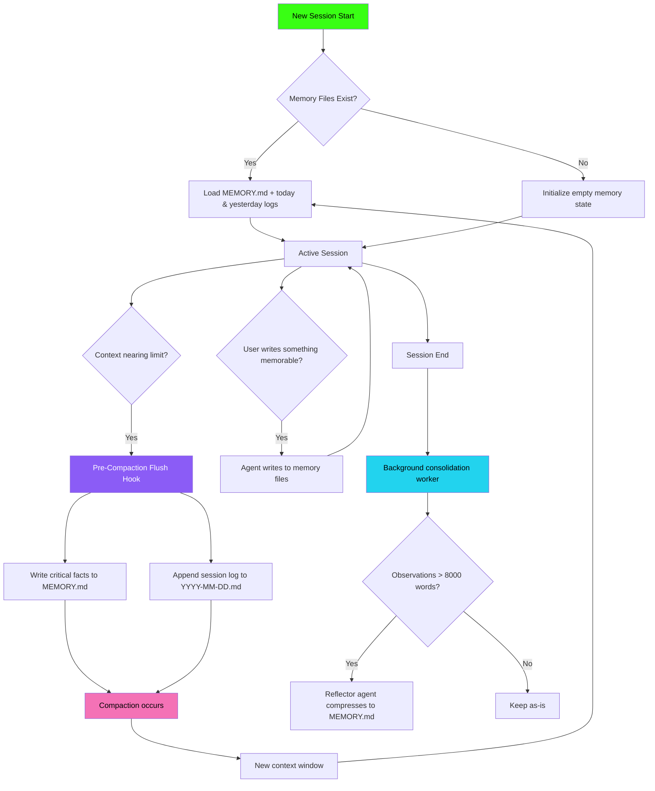
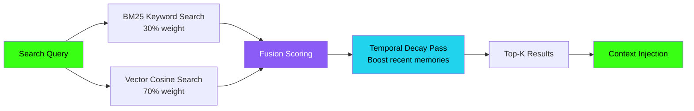

# 👻 SpookyJuice — The Persistent Ghost Newsletter

> **A Persistent AI Agent Platform** · `@SpookyJuiceAI` · `spookyjuice.ai`

[](./issue-01/the-persistent-ghost-issue-01.html)
[](https://spookyjuice.ai)
[](https://x.com/SpookyJuiceAI)
[](https://discord.gg/spookyjuice)
[](https://www.shopclawmart.com/listings/6d2310ca-2f93-4e96-868a-d5fc8f007c9f)

---

## What Is This?

**The Persistent Ghost** is the official newsletter of SpookyJuice — a platform for building AI agents that maintain identity, memory, and context across sessions. Where most AI resets with every chat, SpookyJuice agents **remember**.

This repository contains:

- Newsletter HTML source files (ready to send via Beehiiv)
- The SpookyJuice Hub landing page
- Automated multi-platform publish workflow (Beehiiv, Discord, X)
- OpenClaw memory architecture research and documentation
- Benchmarking frameworks and measurement methodology

---

## Repository Structure

```
newsletters/
├── README.md                          ← You are here
├── RELEASE_WORKFLOW.md                ← Step-by-step release process
├── BENCHMARKING.md                    ← Memory performance measurement framework
├── DISTRIBUTION.md                    ← Multi-platform distribution strategy
├── .env.example                       ← Environment variable template
│
├── assets/
│   └── logo-300.png                   ← Brand logo (web-optimized)
│
└── issue-01/
    ├── the-persistent-ghost-issue-01.html  ← Newsletter HTML
    ├── spookyjuice-hub.html               ← Link-in-bio / hub page
    └── meta.json                          ← Publish metadata (title, threads, etc.)
```

### Publish Script

The publish workflow lives in the main repo at `scripts/publish-newsletter.sh`. Run it from the repo root:

```bash
# Dry run (preview what would happen)
./scripts/publish-newsletter.sh 1 --dry-run

# Publish everywhere (Beehiiv draft + Discord + X + web deploy)
./scripts/publish-newsletter.sh 1

# Publish and send email immediately
./scripts/publish-newsletter.sh 1 --send

# Skip specific platforms
./scripts/publish-newsletter.sh 1 --skip-x --skip-discord
```

---

## Current Release

### Issue #1: The Beginning — March 2026

**Status:** ✅ Released

| Component | Status | Link |
|-----------|--------|------|
| Newsletter HTML | ✅ Complete | `the-persistent-ghost-issue-01.html` |
| Hub Landing Page | ✅ Complete | `spookyjuice-hub.html` |
| ClawMart Listing | ✅ Live | [View →](https://www.shopclawmart.com/listings/6d2310ca-2f93-4e96-868a-d5fc8f007c9f) |
| Twitter Announcement | 🔲 Pending | [@SpookyJuiceAI](https://x.com/SpookyJuiceAI) |
| Discord Announcement | 🔲 Pending | SpookyJuice.AI |
| Beehiiv Send | 🔲 Pending | — |

---

## OpenClaw Memory Architecture Overview

SpookyJuice is built on OpenClaw's memory ecosystem. The architecture consists of seven distinct layers:

```
Layer 7  ████████████████████  Knowledge Graph (SQLite + FTS5)      [Persistent]
Layer 6  ████████████████      Curated Long-Term Memory (MEMORY.md) [Durable]
Layer 5  ████████████          Daily Append-Only Log                 [7-day TTL]
Layer 4  ████████              Hybrid Vector Search (BM25+Semantic)  [Indexed]
Layer 3  ██████                External Tool Memory (Mem0, Cognee)   [Plugin]
Layer 2  ████                  Conversation Context Window           [Session]
Layer 1  ██                    Ephemeral Working Memory              [Volatile]
```

### Key Insight: The Pre-Compaction Flush

> Most users never discover this feature. When a session nears auto-compaction, OpenClaw triggers a **silent agentic turn** that writes durable memory before the context window is cleared. Controlled via `agents.defaults.compaction.memoryFlush`. This prevents the "woke up with amnesia" problem.

---

## Memory Architecture Flowchart



---

## Hybrid Search Architecture



---

## Community Memory Architecture Comparison

| Architecture | Layers | Storage | Cost/mo | Key Strength |
|---|---|---|---|---|
| **12-Layer (coolmanns)** | 12 | SQLite+FTS5+Vector | ~$0.10 | Activation scoring with hot/warm/cool decay |
| **Cognitive (Shawn Harris)** | 6 | File-based | ~$0.05 | Neuroscience-inspired memory gating |
| **Metacognitive (CoderofTheWest)** | 6 plugins | Hybrid | ~$0.20 | Self-evolving; agent designed its own plugins |
| **Inner Life (DKistenev)** | 9-step loop | File+Graph | ~$0.15 | Confidence scoring (0.95 for facts, 0.50 for inference) |
| **5-Layer Protection (gavdalf)** | 5 | File+Observer | ~$0.15 | Defensive compaction coverage with cron watchers |
| **SpookyJuiceMemoryEngine™** | 7 | Modular | TBD | Portable across runtimes, not just OpenClaw |

---

## How to Contribute Benchmarks

We need community benchmarks. See `BENCHMARKING.md` for the full measurement framework. Short version:

1. **Fork this repo**
2. **Run the benchmark suite** using the scripts in `docs/benchmarks/`
3. **Fill out the benchmark template** in `BENCHMARKING.md`
4. **Submit a PR** with your results

We're especially interested in:
- Memory insertion throughput (writes/sec under load)
- Retrieval latency at different corpus sizes
- Pre-compaction flush timing and accuracy
- Hybrid vs. pure vector search quality scores
- Cross-session recall accuracy

---

## Connect

| Platform | Handle | Link |
|----------|--------|------|
| Twitter / X | `@SpookyJuiceAI` | [x.com/SpookyJuiceAI](https://x.com/SpookyJuiceAI) |
| Discord | `SpookyJuice.AI` | SpookyJuice server |
| Website + Engineering Blog | `spookyjuice.ai` | [spookyjuice.ai](https://spookyjuice.ai) |
| ClawMart | Memory Guide | [View listing →](https://www.shopclawmart.com/listings/6d2310ca-2f93-4e96-868a-d5fc8f007c9f) |
| Newsletter | The Persistent Ghost | This repo |

---

## License

Content © 2026 SpookyJuice. The ghost persists.

> *"The ghost does not sleep. The ghost does not forget. The ghost persists."*
